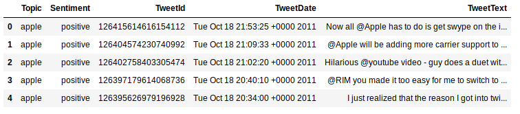
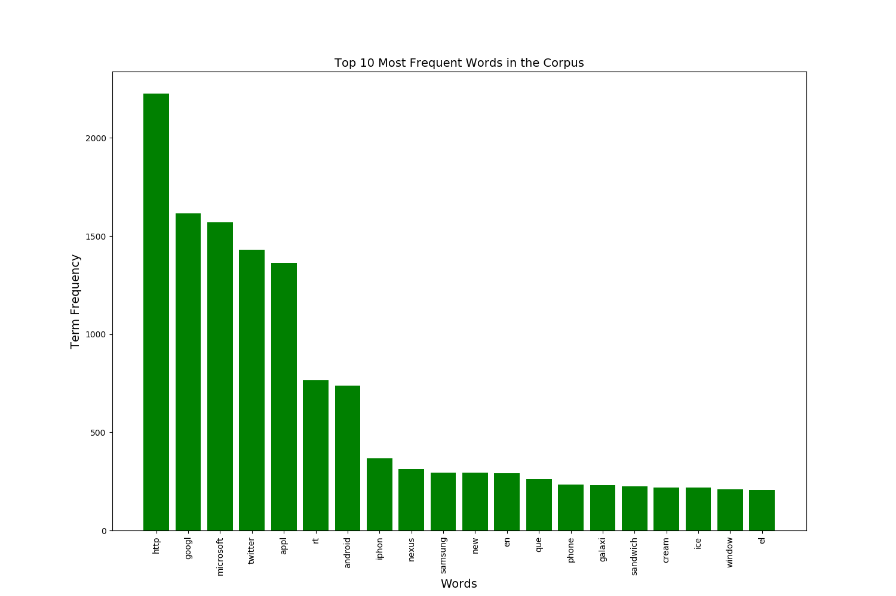
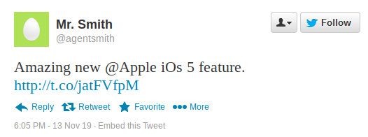
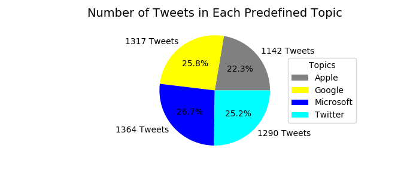
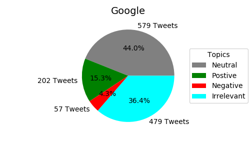
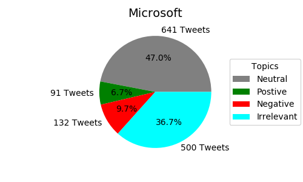
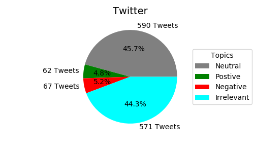
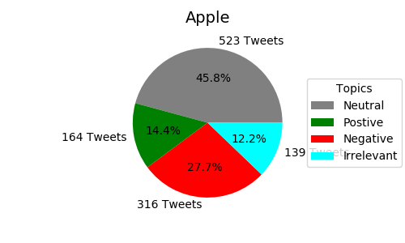
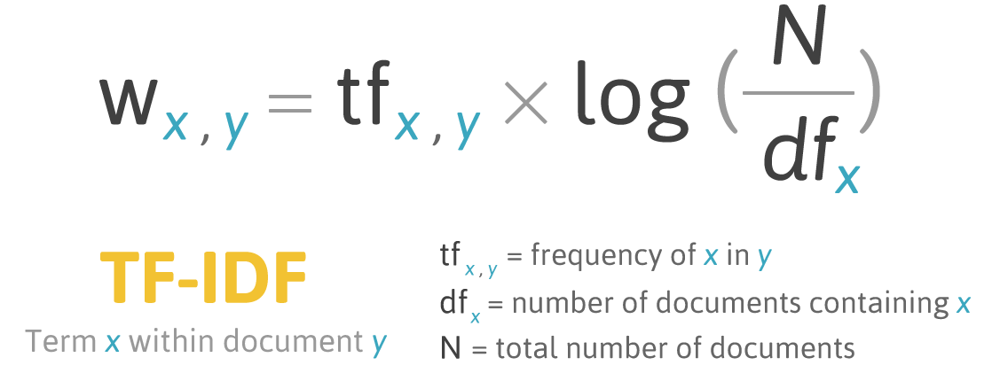
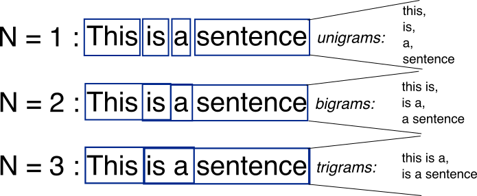

# Tweets: Who's Saying What
A common problem in NLP is analyzing the sentiment of a given of text. This has many applications especially with the amount of text data that social media produces. For tech companies having a way to get customer feedback on new products is vital to the
product lifecycle. And social media has become a great avenue to receive that feedback almost instantaneously. 

Being able to distill all the information that social media provides companies can be a real
challenge. This project was an attempt to tackle that challenge.

# EDA

But before I could get into any of the fun topic modeling and analysis some EDA was in order. As per my usual work flow when working with and cleaning data I read the csv file into a pandas data frame, here is a snippet of that data frame.

## The Data

- The data used for this project was taken from the famous Twitter Sentiment Corpus produced by Sanders Analytics LLC.
- Each of the tweets were hand classified as talking about either Apple, Google, Microsoft, or Twitter as well as having a sentiment of either positive, negative, neutral or irrelevant. For the purposes of this project I decided to ignore the tweets that were labeled as irrelevant.
- The data also had tweets labeled with the Tweet User ID and the Tweet Date. Both labels were ignored for this project.

To get a general feel of the data the first thing I wanted to do was get a word count of all the words in the corpus, except for stop words.

Not surprisingly we see that Apple, Google, Microsoft, and Twitter and among the most popular words in the corpus, which makes sense since all of the tweets are talking about one of those companies. But none of those occur as much as http. This is due to the Stemming that was used when gathering the word count. Anytime there was a hyper link in the tweet everything in the url would get dropped from the stemmer, except the http. Seeing that there is almost 2500 http occurrences and 5113 tweets, there is almost half as many links as there are tweets. This seems to indicate that when talking about these companies that people are often sharing links to news articles about the company or maybe images about the companies products. Take for example this tweet.

Another thing to take note of is that we see some Spanish words pop up in the top 20 words. This presented an additional challenge when doing the preprocessing as I had to make an additional list of Spanish stopwords to add to Gensims built in list of stop words.  

## Notes about the data

| Type of Tweets                   | Number of Tweets |
| -------------------------------- | --------------   |
| All Tweets                       | 5113             |
| Tweets with Positive Sentiment   | 519              |
| Tweets with Negative Sentiment   | 572              |
| Tweets with Neutral Sentiment    | 2333             |
| Tweets with Irrelevant Sentiment | 1689             |
| Tweets about Apple               | 1142             |
| Tweets about Google              | 1317             |
| Tweets about Microsoft           | 1364             |
| Tweets about Twitter             | 1290             |

| Sentiment Distribution                                      | Topic Distribution                                           |
|------------------------------------------------------------ | ------------------------------------------------------------ |
|  |  |

Unsurprisingly and unfortantely the amount of tweets that had neither a positive or negative sentiment was almost 80% of the tweets, giving me very little data to look at if I was going to do topic modeling based off sentiments. Fortunately the tweets were almost perectly divided when seperating the data by Topics. After seeing how uneven and evenly distributed the sentiments and topics were I was curious to look at how the sentiments were distributed amoungst tweets talking about each of the 4 companies.

|  Sentiment Distribution For Google and Twitter     | Sentiment Distribution For Microsoft and Apple       |
|------------------------------------------------------ | ------------------------------------------------------- |
|   |  |
|  |      |

For the most part these sentiment distributions seemed to follow the same trend as the whole corpus, with the exception of Apple having a rather large portion of tweets having a negative sentiment.

# The Process
- Removing stop words (i.e. the, and, a, etc.)
- Perform Lemmatization which is an algorithm that will distill words down to their root. (i.e. running becomes run)
- Getting Inverse Document Frequency of each term in the corpus.
  - The formula for the TF-IDF is described by the image below.
  
    
- For sentiment classification I used an n-gram range of 1-5.
  - Example of differnt N-Grams
  
  
- I created 2 different classification models.
- One for classifying whether the tweet was talking about either Apple, Google, Microsoft, or Twitter.
- One for determining if the tweet had a sentiment of either Positive, Negative, or Neutral.
- Both models used Sklearn’s Multinomial Naïve Bayes to classify tweets.

# Results
| Model                                                               | Accuracy | F1 Score |
| ------------------------------------------------------------------- | -------- | -------- |
| Naive Bayes trained on TF-IDF for Sentiment Classification          | 68%      | 68%      |
| Naive Bayes trained on TF-IDF for Topic Classification              | 96%      | 96%      |
| Logistic Regression trained on Doc2Vec for Sentiment Classification | 39%      | 39%      |
| Naive Bayes trained on Doc2Vec for Sentiment Classification         | 35%      | 22%      |

# Conclusion
Classification based on the topic of the tweet was far more accurate than the classification of sentiment with scores of 96% and 68% respectively. This is most likely due to the fact that the language regarding the companies is very different. For example if a tweet is talking about an Iphone, it is almost certain that that particular tweet is talking about Apple. Sentiment can be a bit more subtle and can be a challenge to differentiate even for humans. I also attempted to use doc2vec to featurize the text as opposted to TF-IDF with underwhelming results. This is because doc2vec creates a paragraph vector and requires documents to contain a lot of text. The 244-character limit for tweets was too small to fully utilize doc2vec.

## Next Steps
- 68% can be improved upon if featurization is done in a different manner or possibly using a different classification model.
- No matter the topic of the tweet it will get classified as either talking about one of the four companies. New data is required to make an “other” class.
