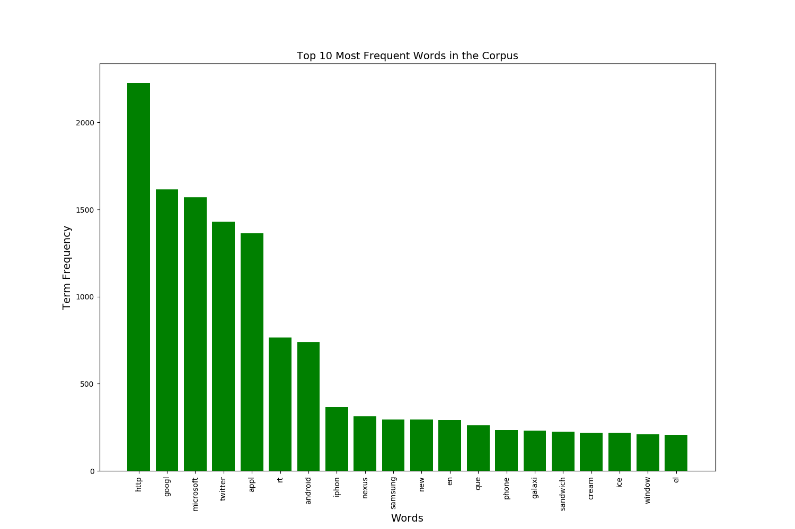
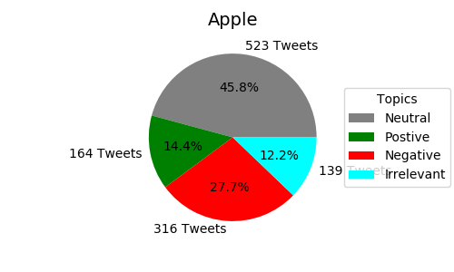
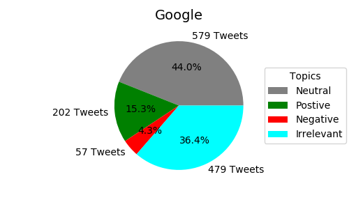
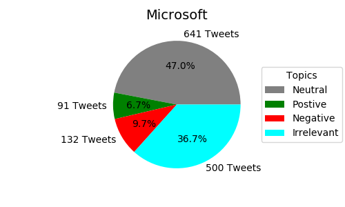
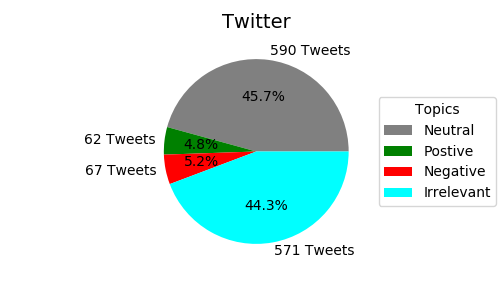
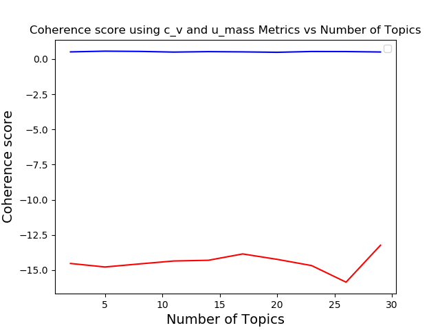

# Analysis and Topic Modeling on Twitter Data

## Goal and Summary of my Work
My goal for the project was to use topic modeling on a twitter dataset to help provide insights to what conversations surrounding Apple, Google, Microsoft, and Twitter looked like online. Doing this could be a good way to do market research and give useful insights into potential subpopulations of customer bases for each of the companies, and what those subpopulations are talking about. Since each of these companies are major tech companies it is reasonable to assume that a common meeting ground for discussing these companies would be on social media and that the conversations held here could be more or less representative of the customer base as a whole.

The original plan was to try and create 4 clusters that were somewhat representative of each of those companies. After getting unsatisfactory results using LDA and K-Means for 4 clusters I made a coherence plot to see what the optimal number of clusters would be for this corpus. From the plot you could seee that 12 clusters gave the highest coherence score, so I ran LDA agian except this time with 12 clusters. The results were still not was I was hoping for, so I needed to try another tactic. 

I then decided to brake up the dataset into fourths based on which companies the tweets were talking about. This seemed to produce slightly better results but required a little bit of extra preprocessing that I will discuss later. When performing topic modeling on each of these smaller corpuses I was a little smarter about it and made a couple of different coherence plots for each of the corpus to find the optimal number of clusters to use. The reason for making multiple coherence plots was because I didn't have a random state set the coherence plots were slightly different on each run.


### Models used:
- Latent Dirichlet Allocation (LDA)
    - Soft Clustering
- K-Means Clustering
    - Hard Clustering

# EDA

But before I could get into any of the fun topic modeling and analysis some EDA was in order. As per my usual work flow when working with and cleaning data I read the csv file into a pandas data frame, here is a snippet of that data frame.


To get a general feel of the data the first thing I wanted to do was get a word count of all the words in the corpus, except for stop words.



Not surprisingly we see that Apple, Google, Microsoft, and Twitter and among the most popular words in the corpus, which makes sense since all of the tweets are talking about one of those companies. But none of those occur as much as http. This is due to the Stemming that was used when gathering the word count. Anytime there was a hyper link in the tweet everything in the url would get dropped from the stemmer, except the http. Seeing that there is almost 2500 http occurrences and 5113 tweets, there is almost half as many links as there are tweets. This seems to indicate that when talking about these companies that people are often sharing links to news articles about the company or maybe images about the companies products. Take for example this tweet.

> 'Amazing new @Apple iOs 5 feature.  http://t.co/jatFVfpM'


Another thing to take note of is that we see some Spanish words pop up in the top 20 words. This presented an additional challenge when doing the preprocessing as I had to make an additional list of Spanish stopwords to add to Gensims built in list of stop words.  

## Notes about the data


| Type of Tweets                   | Number of Tweets |
| -------------------------------- | --------------   |
| All Tweets                       | 5113             |
| Tweets with Positive Sentiment   | 519              |
| Tweets with Negative Sentiment   | 572              |
| Tweets with Neutral Sentiment    | 2333             |
| Tweets with Irrelevant Sentiment | 1689             |
| Tweets about Apple               | 1142             |
| Tweets about Google              | 1317             |
| Tweets about Microsoft           | 1364             |
| Tweets about Twitter             | 1290             |


Unsurprisingly and unfortantely the amount of tweets that had neither a positive or negative sentiment was almost 80% of the tweets, giving me very little data to look at if I was going to do topic modeling based off sentiments. Fortunately the tweets were almost perectly divided when seperating the data by Topics. After seeing how uneven and evenly distributed the sentiments and topics were I was curious to look at how the sentiments were distributed amoungst tweets talking about each of the 4 companies.


 
 

For the most part these sentiment distributions seemed to follow the same trend as the whole corpus, with the exception of Apple having a rather large portion of tweets having a negative sentiment.


# NLP Workflow
Now that I had my initial EDA out of the way I could start my NLP and perform my topic modeling. Below was my general work flow for when cleaning the text and running any of the models.

1. Read csv file into a pandas dataframe.
2. Segmented dataframe into smaller ones based on topic while preserving the original dataframe.
3. Converted the dataframe to a feature matrix (a numpy array of tweets or documents) as my corpus.
4. Used Gensim's built in Stopwords list to remove stop words.
    - Due to the high number of tweets in Spanish I als created a custom file of spanish stopwords.
        - List base for Spanish stopwords was taken from here: https://github.com/Alir3z4/stop-words/blob/master/spanish.txt
    - Created another file of words that were frequently occuring in all clusters to add to my stopwords.
5. Tokenized each of the documents in my corpus using NLTK's Snowball Stemmer and WordnetLemmatizer.
6. Created a Bag of Words for each document in the corpus.
7. Focused on LDA for topic modeling using gensim library.
    - Gensim had more LDA models and had significant computation time over kmeans (especially when using LDAmulticore)
        - Maybe I could time this?
8. Used coherence plots to determine optimal number of topics.
    - For the entire set I tried using 4 clusters as I was attempting to produce categories that represented Apple, Google, Microsoft, and Twitter.
    - After having latent topics with with many common words I decided to make coherence plots.
    - For the smaller corpus's of tweets about the four companies I plotted coherence before peforming topic modeling.
    - Taken from the paper 'Full-Text or Abstract?Examining Topic Coherence Scores Using LatentDirichlet Allocation' regarding the c_v metric.
    > c_v is  based  on four  parts:  (i)  segmentation  of  the  data  into  word  pairs,  (ii)calculation of word or word pair probabilities, (iii) calculation of a confirmation measure that quantifies how strongly a wordset supports another word set, and finally (iv) aggregation of individual  confirmation  measures  into  an  overall  coherence score.




9. Number of Clusters decided.
    - Entire dataset: 12
    - Apple: 5
    - Google: 3
    - Microsoft: 5
    - Twitter: 5
9. Relevancy metric
    - small values of λ (near 0) highlight potentially rare, but exclusive terms for the selected topic, and large values of λ (near 1)
    - value of 0.5 seemed to be giving me the best result for clustering on the entire corpus


# Entire Corpus
As stated 

# Model Evaluation for K-Means
## Here are the results for running K-Means on the whole corpus
Top terms per cluster:
1. Cluster 0:
    - microsoft
    - http
    - google
    - rt
    - windows
    - android
    - ballmer
    - yahoo
    - en
    - nexusprime
2. Cluster 1:
    - twitter
    - rt
    - facebook
    - que
    - en
    - el
    - http
    - la
    - es
    - goodnight
3. Cluster 2:
    - android
    - google
    - nexus
    - sandwich
    - cream
    - ice
    - samsung
    - galaxy
    - http
    - ics
4. Cluster 3:
    - apple
    - iphone
    - siri
    - http
    - ios5
    - store
    - 4s
    - new
    - ios
    - iphone4s
 

# Model Evaluation For LDA
## Here are the metrics when I took out English, Spanish, and my custom stopwords.
### Apple
```
Latent Topics for Tweets about Apple
[(0,
  '0.038*"io" + 0.012*"thank" + 0.010*"ipad" + 0.010*"updat" + 0.009*"store" + '
  '0.006*"dear" + 0.006*"app" + 0.005*"batteri" + 0.004*"today" + 0.004*"lt"'),
 (1,
  '0.028*"siri" + 0.008*"io" + 0.007*"time" + 0.006*"get" + 0.005*"wait" + '
  '0.005*"work" + 0.005*"network" + 0.005*"need" + 0.005*"photo" + '
  '0.004*"steve"'),
 (2,
  '0.014*"love" + 0.007*"day" + 0.007*"store" + 0.006*"servic" + 0.005*"updat" '
  '+ 0.005*"go" + 0.005*"time" + 0.005*"io" + 0.005*"siri" + 0.005*"product"'),
 (3,
  '0.011*"store" + 0.006*"think" + 0.006*"weekend" + 0.006*"camera" + '
  '0.005*"line" + 0.005*"million" + 0.005*"go" + 0.004*"siri" + 0.004*"want" + '
  '0.004*"soni"'),
 (4,
  '0.014*"store" + 0.013*"siri" + 0.009*"ipad" + 0.009*"win" + 0.008*"ipod" + '
  '0.008*"io" + 0.008*"great" + 0.007*"memori" + 0.007*"touch" + '
  '0.007*"mommy_gaga"')]

Perplexity:  -8.093552124640825

Coherence Score:  0.4623035150952807
```

### Google
```
Latent Topics for Tweets about Google
[(0,
  '0.010*"samsung" + 0.007*"galaxynexus" + 0.007*"icecreamsandwich" + '
  '0.006*"asia" + 0.005*"seo" + 0.005*"googleplus" + 0.005*"market" + '
  '0.005*"beam" + 0.005*"user" + 0.005*"teamfollowback"'),
 (1,
  '0.034*"nexus" + 0.027*"samsung" + 0.023*"galaxi" + 0.020*"ic" + '
  '0.016*"nexusprim" + 0.008*"twandroid" + 0.006*"look" + 0.006*"search" + '
  '0.006*"icecreamsandwich" + 0.003*"galaxynexus"'),
 (2,
  '0.037*"sandwich" + 0.036*"ice" + 0.036*"cream" + 0.022*"nexus" + '
  '0.018*"galaxi" + 0.016*"samsung" + 0.009*"ic" + 0.009*"icecreamsandwich" + '
  '0.008*"dhilipsiva" + 0.007*"galaxynexus"')]

Perplexity:  -7.777554474473828

Coherence Score:  0.5390881330780398
```

### Microsoft
```
Latent Topics for Tweets about Microsoft
[(0,
  '0.009*"ballmer" + 0.007*"steveballm" + 0.007*"steve" + 0.005*"yahoo" + '
  '0.004*"say" + 0.004*"ceo" + 0.004*"sharepoint" + 0.004*"offic" + '
  '0.004*"een" + 0.003*"need"'),
 (1,
  '0.013*"skype" + 0.010*"ballmer" + 0.009*"window" + 0.009*"yahoo" + '
  '0.006*"web" + 0.005*"lanza" + 0.005*"sitio" + 0.005*"ofici" + 0.005*"xbox" '
  '+ 0.005*"bing"'),
 (2,
  '0.007*"kinect" + 0.005*"user" + 0.005*"learn" + 0.004*"test" + 0.004*"xbox" '
  '+ 0.004*"sharepoint" + 0.003*"excel" + 0.003*"enterpris" + '
  '0.003*"touchscreen" + 0.003*"cloud"'),
 (3,
  '0.021*"window" + 0.012*"ballmer" + 0.009*"steve" + 0.007*"nokia" + '
  '0.005*"free" + 0.005*"wp" + 0.005*"yahoo" + 0.004*"phone" + '
  '0.004*"touchscreen" + 0.004*"buy"'),
 (4,
  '0.021*"window" + 0.009*"cloud" + 0.006*"windowsphon" + 0.005*"mango" + '
  '0.005*"open" + 0.004*"cualquier" + 0.004*"superfici" + 0.004*"omnitouch" + '
  '0.004*"screen" + 0.004*"ballmer"')]

Perplexity:  -8.544697056296924

Coherence Score:  0.5386080105531785
```

### Twitter
```
Latent Topics for Tweets about Twitter
[(0,
  '0.010*"lol" + 0.006*"autopilot" + 0.006*"facebook" + 0.006*"mas" + '
  '0.005*"follow" + 0.005*"free" + 0.005*"shit" + 0.005*"let" + 0.004*"get" + '
  '0.004*"goodnight"'),
 (1,
  '0.009*"tweet" + 0.007*"facebook" + 0.005*"noch" + 0.005*"si" + '
  '0.004*"buena" + 0.004*"mai" + 0.004*"xd" + 0.004*"love" + 0.003*"follow" + '
  '0.003*"go"'),
 (2,
  '0.013*"facebook" + 0.005*"gt" + 0.005*"day" + 0.005*"follow" + 0.005*"hour" '
  '+ 0.005*"second" + 0.005*"minut" + 0.004*"night" + 0.004*"lt" + '
  '0.004*"age"')]

Perplexity:  -8.429003991213502

Coherence Score:  0.5736462770440464
```

Also Here are the K-Means clusters for Each of these topics

```
Clusters for K-Means on apple corpus
Top terms per cluster:
Cluster 0:
 time
 macbook
 apple
 old
 cc
 new
 iphone
 pro
 needs
 miss
Cluster 1:
 rt
 new
 apple
 iphone4s
 http
 iphone
 siri
 battery
 store
 ios5
Cluster 2:
 apple
 http
 iphone
 siri
 4s
 ios5
 store
 app
 ipad
 just
Cluster 3:
 did
 fuck
 music
 apple
 like
 delete
 hold
 just
 launch
 update


Clusters for K-Means on google corpus
Top terms per cluster:
Cluster 0:
 cream
 ice
 sandwich
 android
 http
 google
 nexus
 galaxy
 samsung
 dhilipsiva
Cluster 1:
 google
 android
 ics
 nexusprime
 rt
 icecreamsandwich
 galaxynexus
 samsung
 twandroid
 http
Cluster 2:
 http
 google
 facebook
 seo
 search
 bookcase
 rt
 twitter
 asia
 ebook
Cluster 3:
 nexus
 galaxy
 samsung
 android
 http
 google
 new
 ics
 dhilipsiva
 galaxynexus


Clusters for K-Means on microsoft corpus
Top terms per cluster:
Cluster 0:
 hyperv
 emc
 white
 fast
 paper
 hp
 applications
 scvmm
 2012
 e2evc
Cluster 1:
 en
 el
 kinect
 microsoft
 http
 cualquier
 superficie
 táctil
 rt
 que
Cluster 2:
 ballmer
 android
 steve
 yahoo
 ceo
 http
 microsoft
 lucky
 buying
 steveballmer
Cluster 3:
 microsoft
 http
 windows
 rt
 apple
 skype
 phone
 cloud
 new
 search


Clusters for K-Means on twitter corpus
Top terms per cluster:
Cluster 0:
 los
 tweets
 twitter
 el
 en
 que
 al
 la
 thank
 retweeted
Cluster 1:
 rt
 twitter
 don
 best
 got
 yonopienso_
 fuckyoumean
 pittsburgh
 retweets
 life
Cluster 2:
 twitter
 http
 facebook
 goodnight
 like
 rt
 follow
 night
 followers
 lol
Cluster 3:
 que
 en
 el
 twitter
 la
 es
 lo
 por
 para
 mi
```

# Conclusion
- LDA seemed to perform better when the data was segmented. It appears that having text that is talking about one topic, or in this case one company. Will produce clearer latent topics.
- Since LDA is a probabilistic model it will usually have high variance and low bias, LDA will perform much better when given larger amounts of data.
    - Although in this case having coherent topics seemed to matter more than having a slightly larger dataset.
- Topic modeling is generally not very effective on shorter documents (i.e. Tweets).

