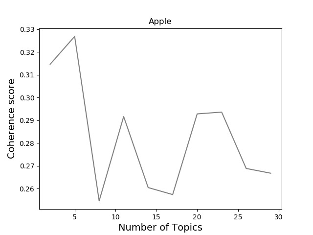
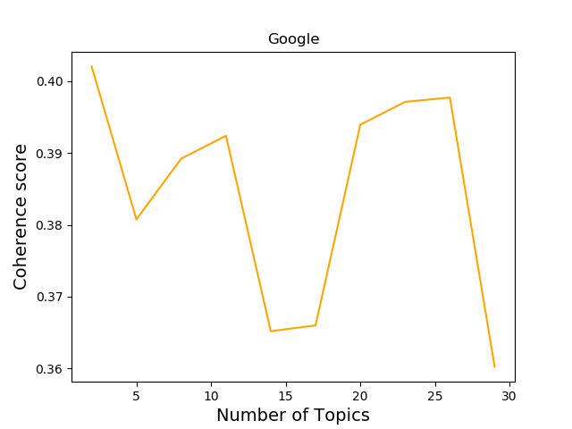
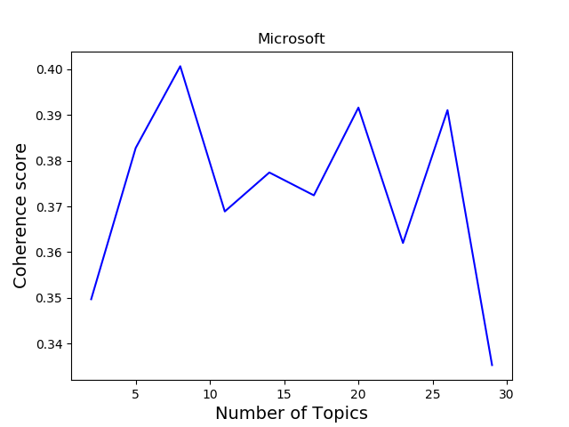
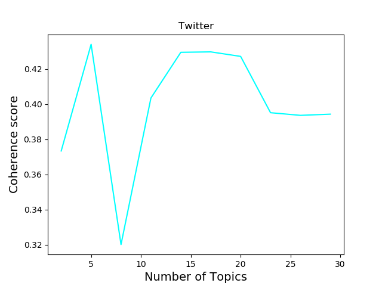

# Analysis and Topic Modeling on Twitter Data

## Goal
My goal for the project was to be able to identify clusters within the entire corpus with hopes of creating latent topics that were representative of the predefined topics given in the CSV file. Those topics being Apple, Google, Microsoft, and Twitter. In addition to this I wanted to look at the different clusters that would be created when segementing the entire corpus into these four predefined topics. Doing this could give useful insights into potential subpopulations of customer bases for each of the companies, and what those subpopulations are talking about.

### Models used:
- Latent Dirichlet Allocation (LDA)
    - Soft Clustering
- K-Means Clustering
    - Hard Clustering

# EDA
## Notes about the data

- 5113 total documents
    - Sentiment
        - 519 documents labeled as having a positive sentiment
        - 572 documents labeled as having a negative sentiment
        - 2333 documents labeled as having a neutral sentiment
        - 1689 documents labeled as having an irrelevant sentiment
    - Topics
        - 1142 documents labeled as having a topic of Apple
        - 1317 documents labeled as having a topic of Google
        - 1364 documents labeled as having a topic of Microsoft
        - 1290 documents labeled as having a topic of Twitter


# NLP Workflow
1. Read csv file into a pandas dataframe.
2. Segmented dataframe into smaller ones based on topic while preserving the original dataframe.
3. Converted the dataframe to a feature matrix (a numpy array of tweets or documents) as my corpus.
4. Used Gensim's built in Stopwords list to remove stop words.
    - Due to the high number of tweets in Spanish I als created a custom file of spanish stopwords.
        - List base for Spanish stopwords was taken from here: https://github.com/Alir3z4/stop-words/blob/master/spanish.txt
    - Created another file of words that were frequently occuring in all clusters to add to my stopwords.
5. Tokenized each of the documents in my corpus using NLTK's Snowball Stemmer and WordnetLemmatizer.
6. Created a Bag of Words for each document in the corpus.
7. Focused on LDA for topic modeling using gensim library.
    - Gensim had more LDA models and had significant computation time over kmeans (especially when using LDAmulticore)
        - Maybe I could time this?
8. Used coherence plots to determine optimal number of topics.
    - For the entire set I tried using 4 clusters as I was attempting to produce categories that represented Apple, Google, Microsoft, and Twitter.
    - After having latent topics with with many common words I decided to make coherence plots.
    - For the smaller corpus's of tweets about the four companies I plotted coherence before peforming topic modeling.
    - Taken from the paper 'Full-Text or Abstract?Examining Topic Coherence Scores Using LatentDirichlet Allocation' regarding the c_v metric.
    > c_v is  based  on four  parts:  (i)  segmentation  of  the  data  into  word  pairs,  (ii)calculation of word or word pair probabilities, (iii) calculation of a confirmation measure that quantifies how strongly a wordset supports another word set, and finally (iv) aggregation of individual  confirmation  measures  into  an  overall  coherence score.





9. Number of Clusters decided.
    - Entire dataset: 12
    - Apple: 5
    - Google: 3
    - Microsoft: 5
    - Twitter: 5
9. Relevancy metric
    - small values of λ (near 0) highlight potentially rare, but exclusive terms for the selected topic, and large values of λ (near 1)
    - value of 0.5 seemed to be giving me the best result for clustering on the entire corpus


# Model Evaluation
## Here are the metrics and top ten words in each topic when only taking out English and Spanish stopwords.
### Apple
```
Latent Topics for Tweets about Apple
[(0,
  '0.095*"appl" + 0.029*"iphon" + 0.014*"siri" + 0.011*"new" + 0.007*"phone" + '
  '0.005*"thank" + 0.005*"updat" + 0.004*"fuck" + 0.004*"sell" + '
  '0.004*"store"'),
 (1,
  '0.087*"appl" + 0.028*"iphon" + 0.025*"io" + 0.010*"siri" + 0.009*"ipad" + '
  '0.007*"new" + 0.006*"love" + 0.006*"like" + 0.005*"thank" + 0.005*"updat"'),
 (2,
  '0.077*"appl" + 0.019*"store" + 0.014*"app" + 0.009*"iphon" + 0.008*"io" + '
  '0.007*"great" + 0.006*"ipad" + 0.006*"win" + 0.006*"world" + 0.006*"touch"')]

Perplexity:  -7.2930994936406055

Coherence Score:  0.29702751682391076
```

### Google
```
Latent Topics for Tweets about Google
[(0,
  '0.103*"googl" + 0.060*"android" + 0.044*"nexus" + 0.034*"sandwich" + '
  '0.034*"ice" + 0.034*"cream" + 0.033*"galaxi" + 0.031*"samsung" + 0.015*"ic" '
  '+ 0.008*"new"'),
 (1,
  '0.094*"googl" + 0.051*"android" + 0.020*"icecreamsandwich" + '
  '0.015*"samsung" + 0.012*"new" + 0.012*"beam" + 0.010*"ic" + 0.009*"bookcas" '
  '+ 0.008*"galaxynexus" + 0.008*"nfc"'),
 (2,
  '0.060*"googl" + 0.013*"nexusprim" + 0.011*"samsung" + '
  '0.008*"icecreamsandwich" + 0.008*"twitter" + 0.006*"twandroid" + '
  '0.006*"galaxynexus" + 0.006*"android" + 0.006*"nouvell" + 0.005*"asia"'),
 (3,
  '0.046*"googl" + 0.009*"facebook" + 0.008*"twitter" + 0.006*"microsoft" + '
  '0.005*"appl" + 0.004*"manag" + 0.004*"ebook" + 0.004*"pdf" + 0.004*"ad" + '
  '0.004*"onlin"'),
 (4,
  '0.051*"googl" + 0.012*"nexusprim" + 0.009*"search" + 0.007*"twandroid" + '
  '0.007*"ic" + 0.007*"sur" + 0.006*"possibilité" + 0.005*"facebook" + '
  '0.005*"een" + 0.005*"check"'),
 (5,
  '0.104*"googl" + 0.039*"android" + 0.014*"sandwich" + 0.013*"ice" + '
  '0.013*"cream" + 0.011*"samsung" + 0.011*"nexus" + 0.010*"ic" + 0.008*"new" '
  '+ 0.007*"galaxi"'),
 (6,
  '0.058*"googl" + 0.017*"android" + 0.013*"asia" + 0.011*"samsung" + '
  '0.010*"nexus" + 0.007*"asiaclassifiedtoday" + 0.007*"fail" + 0.007*"galaxi" '
  '+ 0.006*"new" + 0.005*"ic"'),
 (7,
  '0.079*"googl" + 0.018*"search" + 0.017*"seo" + 0.008*"bing" + '
  '0.006*"nexusprim" + 0.006*"page" + 0.005*"samsung" + 0.005*"user" + '
  '0.005*"android" + 0.005*"ic"')]

Perplexity:  -7.256229432792373

Coherence Score:  0.42567386166532106
```

### Microsoft
```
Latent Topics for Tweets about Microsoft
[(0,
  '0.070*"microsoft" + 0.007*"appl" + 0.006*"surfac" + 0.006*"screen" + '
  '0.006*"omnitouch" + 0.005*"touch" + 0.005*"window" + 0.005*"touchscreen" + '
  '0.005*"googl" + 0.004*"roslyn"'),
 (1,
  '0.067*"microsoft" + 0.019*"yahoo" + 0.012*"ballmer" + 0.008*"googl" + '
  '0.008*"buy" + 0.007*"steve" + 0.007*"lucki" + 0.006*"ceo" + 0.006*"live" + '
  '0.005*"cloud"'),
 (2,
  '0.100*"microsoft" + 0.019*"window" + 0.007*"skype" + 0.007*"ballmer" + '
  '0.007*"phone" + 0.007*"android" + 0.006*"new" + 0.006*"steve" + '
  '0.006*"cloud" + 0.004*"xbox"'),
 (3,
  '0.074*"microsoft" + 0.007*"android" + 0.006*"sharepoint" + 0.005*"appl" + '
  '0.005*"kinect" + 0.004*"ballmer" + 0.004*"googl" + 0.003*"gt" + '
  '0.003*"want" + 0.003*"phone"'),
 (4,
  '0.059*"microsoft" + 0.014*"window" + 0.009*"phone" + 0.007*"nokia" + '
  '0.007*"store" + 0.006*"free" + 0.006*"wp" + 0.006*"devic" + 0.004*"ballmer" '
  '+ 0.004*"voor"')]

Perplexity:  -7.9710237501587

Coherence Score:  0.43605869863521934
```

### Twitter
```
Latent Topics for Tweets about Twitter
[(0,
  '0.065*"twitter" + 0.008*"follow" + 0.007*"facebook" + 0.005*"gt" + '
  '0.005*"sleep" + 0.004*"lt" + 0.004*"tell" + 0.004*"xd" + 0.004*"phone" + '
  '0.004*"ff"'),
 (1,
  '0.083*"twitter" + 0.007*"facebook" + 0.005*"buena" + 0.005*"noch" + '
  '0.005*"night" + 0.004*"good" + 0.003*"si" + 0.003*"updat" + 0.003*"bye" + '
  '0.003*"meu"'),
 (2,
  '0.123*"twitter" + 0.011*"follow" + 0.009*"facebook" + 0.006*"like" + '
  '0.005*"tweet" + 0.005*"day" + 0.004*"mas" + 0.004*"lol" + 0.004*"autopilot" '
  '+ 0.003*"get"')]

Perplexity:  -7.708090451644515

Coherence Score:  0.4964084477660973
```

## Here are the metrics when I took out my custom stopwords as well
### Apple
```
Latent Topics for Tweets about Apple
[(0,
  '0.019*"store" + 0.007*"thank" + 0.007*"great" + 0.007*"servic" + '
  '0.007*"sell" + 0.005*"million" + 0.005*"go" + 0.005*"genius" + '
  '0.005*"custom" + 0.005*"weekend"'),
 (1,
  '0.027*"siri" + 0.014*"io" + 0.006*"job" + 0.006*"steve" + 0.006*"ipad" + '
  '0.005*"work" + 0.005*"tell" + 0.005*"video" + 0.004*"dear" + 0.004*"updat"'),
 (2,
  '0.022*"io" + 0.010*"ipad" + 0.008*"updat" + 0.007*"ipod" + 0.005*"love" + '
  '0.005*"win" + 0.005*"hello" + 0.005*"touch" + 0.005*"world" + '
  '0.005*"icloud"')]

Perplexity:  -7.952605135691126

Coherence Score:  0.39785621433608515
```

### Google
```
Latent Topics for Tweets about Google
[(0,
  '0.033*"nexus" + 0.017*"galaxi" + 0.006*"video" + 0.006*"ic" + '
  '0.005*"icecreamsandwich" + 0.005*"samsung" + 0.005*"mobil" + '
  '0.005*"nexusprim" + 0.004*"live" + 0.004*"data"'),
 (1,
  '0.050*"samsung" + 0.050*"nexus" + 0.039*"galaxi" + 0.022*"galaxynexus" + '
  '0.018*"ic" + 0.015*"icecreamsandwich" + 0.006*"seo" + 0.005*"nuevo" + '
  '0.005*"announc" + 0.005*"look"'),
 (2,
  '0.015*"ic" + 0.008*"nexusprim" + 0.006*"vs" + 0.005*"good" + 0.005*"look" + '
  '0.005*"icecreamsandwich" + 0.005*"adword" + 0.005*"une" + 0.004*"io" + '
  '0.004*"beam"'),
 (3,
  '0.015*"search" + 0.012*"asia" + 0.008*"encrypt" + 0.008*"user" + '
  '0.007*"facebook" + 0.006*"asiaclassifiedtoday" + 0.006*"seo" + '
  '0.006*"default" + 0.004*"ice" + 0.004*"cream"'),
 (4,
  '0.028*"nexusprim" + 0.017*"twandroid" + 0.009*"sur" + 0.006*"ic" + '
  '0.006*"day" + 0.005*"possibilité" + 0.005*"est" + 0.005*"sdk" + '
  '0.004*"facebook" + 0.004*"tout"'),
 (5,
  '0.015*"bookcas" + 0.014*"nexusprim" + 0.011*"digit" + 0.010*"infinit" + '
  '0.009*"twandroid" + 0.007*"releas" + 0.007*"nexus" + 0.007*"bing" + '
  '0.006*"ebook" + 0.006*"nouvell"'),
 (6,
  '0.076*"sandwich" + 0.075*"cream" + 0.075*"ice" + 0.018*"nexus" + '
  '0.017*"samsung" + 0.014*"galaxi" + 0.012*"icecreamsandwich" + 0.010*"ic" + '
  '0.009*"sdk" + 0.008*"dhilipsiva"'),
 (7,
  '0.033*"samsung" + 0.028*"nexus" + 0.022*"galaxi" + 0.016*"ic" + '
  '0.009*"googleplus" + 0.008*"teamfollowback" + 0.008*"gplus" + '
  '0.008*"socialnetwork" + 0.008*"nfc" + 0.007*"asia"')]

Perplexity:  -7.953622857645727

Coherence Score:  0.4976158318513984
```

Twandroid is a French twitter acount that talks about androids

### Microsoft
```
Latent Topics for Tweets about Microsoft
[(0,
  '0.019*"window" + 0.007*"ballmer" + 0.007*"xbox" + 0.007*"yahoo" + '
  '0.007*"skype" + 0.006*"wp" + 0.006*"free" + 0.005*"windowsphon" + '
  '0.005*"mango" + 0.005*"buy"'),
 (1,
  '0.012*"window" + 0.006*"ballmer" + 0.005*"search" + 0.005*"steve" + '
  '0.005*"cloud" + 0.005*"touchscreen" + 0.004*"screen" + 0.004*"user" + '
  '0.004*"start" + 0.004*"want"'),
 (2,
  '0.010*"window" + 0.009*"yahoo" + 0.007*"ballmer" + 0.007*"nokia" + '
  '0.006*"ceo" + 0.005*"lucki" + 0.005*"steve" + 0.004*"buy" + 0.004*"learn" + '
  '0.004*"gt"'),
 (3,
  '0.006*"window" + 0.004*"offic" + 0.004*"live" + 0.004*"screen" + '
  '0.004*"sharepoint" + 0.004*"tech" + 0.003*"come" + 0.003*"omnitouch" + '
  '0.003*"windowsphon" + 0.003*"servic"'),
 (4,
  '0.014*"ballmer" + 0.010*"cloud" + 0.007*"window" + 0.007*"skype" + '
  '0.007*"steve" + 0.006*"lanza" + 0.006*"ofici" + 0.006*"sitio" + '
  '0.006*"phone" + 0.004*"steveballm"')]

Perplexity:  -8.563226329570991

Coherence Score:  0.5768179099165868
```


### Twitter
```
Latent Topics for Tweets about Twitter
[(0,
  '0.010*"follow" + 0.009*"facebook" + 0.006*"autopilot" + '
  '0.006*"teamfollowback" + 0.005*"night" + 0.005*"sleep" + 0.004*"buena" + '
  '0.004*"aday" + 0.004*"noch" + 0.004*"free"'),
 (1,
  '0.007*"get" + 0.007*"lol" + 0.005*"peopl" + 0.005*"facebook" + 0.004*"know" '
  '+ 0.003*"tweet" + 0.003*"fb" + 0.003*"hoy" + 0.003*"build" + 0.003*"xd"'),
 (2,
  '0.012*"facebook" + 0.006*"si" + 0.005*"day" + 0.005*"hour" + 0.005*"tweet" '
  '+ 0.004*"second" + 0.004*"minut" + 0.004*"mas" + 0.004*"qe" + 0.004*"age"')]

Perplexity:  -8.430217097197698

Coherence Score:  0.5779113584573353
```


## What I learned
- LDA seemed to perform better when the data was segmented. It appears that having text that is talking about one topic, or in this case one company. Will produce clearer latent topics.
- Since LDA is a probabilistic model it will usually have high variance and low bias, LDA will perform much better when given larger amounts of data.
    - Although in this case having coherent topics seemed to matter more than having a slightly larger dataset.
- Topic modeling is generally not very effective on shorter documents (i.e. Tweets).

