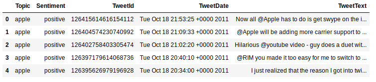
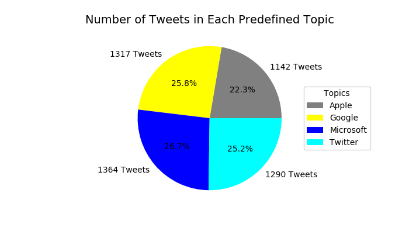
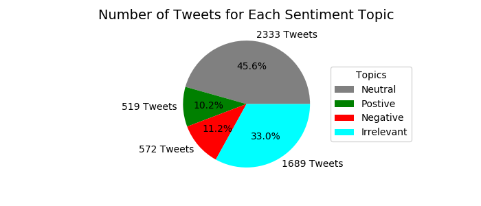

# Analysis and Topic Modeling on Twitter Data

## Goal
My goal for the project was to be able to identify clusters within the entire corpus with hopes of creating latent topics that were representative of the predefined topics given in the CSV file. Those topics being Apple, Google, Microsoft, and Twitter. In addition to this I wanted to look at the different clusters that would be created when segementing the entire corpus into these four predefined topics. Doing this could give useful insights into potential subpopulations of customer bases for each of the companies, and what those subpopulations are talking about.

### Models used:
- Latent Dirichlet Allocation (LDA)
    - Soft Clustering
- K-Means Clustering
    - Hard Clustering

### Notes about the data

- 5113 total documents
    - Sentiment
        - 519 documents labeled as having a positive sentiment
        - 572 documents labeled as having a negative sentiment
        - 2333 documents labeled as having a neutral sentiment
        - 1689 documents labeled as having an irrelevant sentiment
    - Topics
        - 1142 documents labeled as having a topic of Apple
        - 1317 documents labeled as having a topic of Google
        - 1364 documents labeled as having a topic of Microsoft
        - 1290 documents labeled as having a topic of Twitter

### Notes about NLP process
- Focused on LDA using gensim
- Used coherence plot to determine optimal number of topics after trying with 4.
- created a custom file of spanish stopwords since many tweets were in spanish.
    - List base taken from here: https://github.com/Alir3z4/stop-words/blob/master/spanish.txt
- Create another file of words that I personally wanted to add to the stop words list.
- Relevancy metric
    - small values of λ (near 0) highlight potentially rare, but exclusive terms for the selected topic, and large values of λ (near 1)
    - value of 0.5 seemed to be giving me the best result for clustering on the entire corpus

